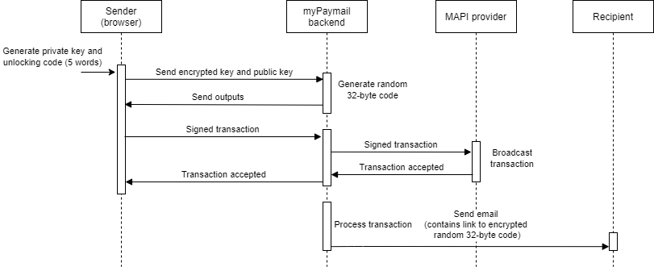
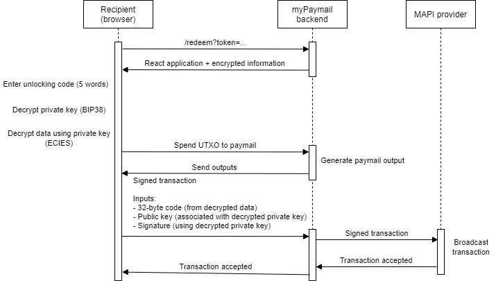
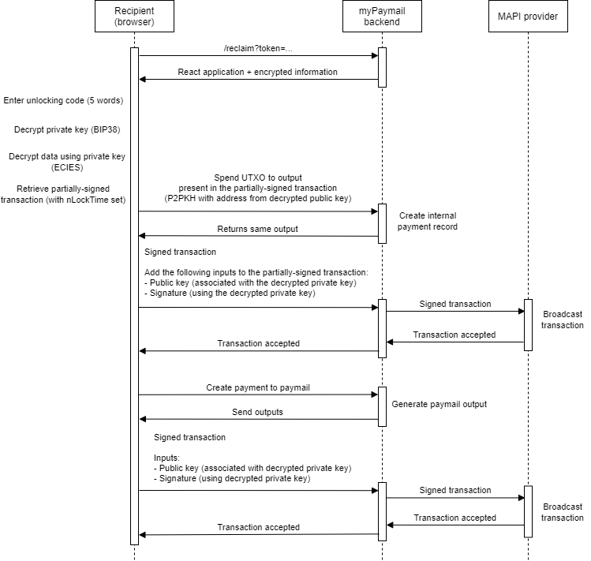
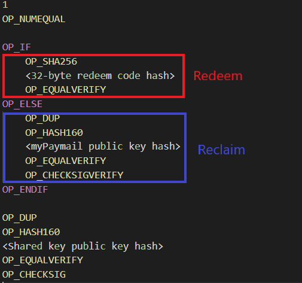

**Table of Contents**

- [Code re-use](#code-re-use)
- [Demo website](#demo-website)
- [Motivation](#motivation)
- [Elevator pitch](#elevator-pitch)
- [Previous solutions](#previous-solutions)
- [Our solution](#our-solution)
- [Technical description](#technical-description)
  - [Sending a payment](#sending-a-payment)
  - [Redeeming a payment](#redeeming-a-payment)
  - [Reclaiming a payment](#reclaiming-a-payment)
  - [Script holding the funds](#script-holding-the-funds)
  - [REST API](#rest-api)
    - [`POST /v1/payments/paymail`](#post-v1paymentspaymail)
    - [`POST /v1/payments/email`](#post-v1paymentsemail)
    - [`POST /v1/utxos/{utxoUuid}/spend`](#post-v1utxosutxouuidspend)
    - [`POST /v1/payments/{paymentUuid}/confirm`](#post-v1paymentspaymentuuidconfirm)
    - [JSON objects](#json-objects)
- [Business model](#business-model)
- [Vision](#vision)


# myPaymail send

## Code re-use

myPaymail send is a new application that uses the myPaymail brand. It is separate from myPaymail (https://mypaymail.co) and has been developed exclusively during the 2020 BSV hackathon.

The full source code of our client application (which runs on the user's browser) is included in this submission. The medium-term plan is to use the same proprietary backend for all the products of the myPaymail family. For this reason, the APIs that myPaymail send uses share some common code with the myPaymail platform. For this hackathon, the myPaymail APIs can be considered an external dependency for the project. The APIs used by myPaymail send are documented in the subsections below.

A more in-depth technical explanation of how the full system works is also provided as part of this hackathon submission (see below).

## Demo website

We provide a working demo as part of the hackathon entry. The demo is hosted at https://bsvhackathon.mypaymail.co. **At this stage, this page is intended to be used only by the judges**. Please send only small amounts and do not hesitate to get in touch if you experience any problems.

The APIs used by the demo website and the website itself will remain frozen and unchanged until the competition ends.

## Motivation

Moving money around the world is slow and inefficient. It is surprising that in a world where almost everything and everyone is online, money still feels like a thing of the past. BitCoin opens up new possibilities to move money quicker, but it is going to take some time to build solutions that can be used by everyone. We believe that the best way to start introducing BitCoin to people is to interface with existing systems that they are already familiar with. One of those systems is email.

## Elevator pitch

If virtually everyone in the world has an email address, why can't you just email money? Our solution allows anyone with a BitCoin wallet to **send money to anyone that has an email address**. Our solution removes the need to have anything installed (wallets, apps, etc.) to receive payments; all that's required is an email address.

## Previous solutions

There are several ways to implement a system that can receive BitCoin over email. We classify them into two broad categories:

### Custodian solutions

In this scenario, users send money to an output script fully controlled by an external company. The same company also provides a way to authenticate and authorise the user that needs to redeem the payment. Because funds are centralised, the recipient has to trust that the company properly secures the funds.

### Emailing private keys

Another approach is to email the private key directly, either in an encrypted or unencrypted form. If just the private key is emailed, the problem is that the sender and the recipient can spend the funds. So, in this case, you need to trust that the sender will not spend the funds by the time the recipient wants to redeem them. If a third party is used to send the email, then that party needs to be trusted as well, as they will see the private key unless it is encrypted. Nonetheless, it is a potentially valid solution if the recipient will redeem the money as soon as it is received.

## Our solution

We wanted to build a cost-effective way of receiving payments over email, and enable the recipient to potentially leave the money in their email inbox until they decide to install a BitCoin wallet.

Our solution solves two problems:
* How do we receive BitCoin without having any application or browser extension installed?
* How do we enable the recipient to redeem the money in a non-custodial way?

We have taken an asymmetric approach to the problem where the sender knows about BitCoin and also knows how to use it (e.g. the sender has a MoneyButton account and some BitCoin). However, the recipient does not need to know about BitCoin or how to use a wallet. A BitCoin wallet is required to redeem the payment but **this can happen at any point in the future**. In our opinion, this is what makes our product disruptive.

## Technical description

Our solution is composed of two parts: a REST API and a React application running on the user's browser. The flow is divided into three parts:

- Sending a payment: the sender delivers funds to an email recipient.
- Redeeming a payment: the recipient unlocks the funds.
- Reclaiming a payment: the sender reclaims the funds after the payment expiration date.

Note that payments can either be redeemed or reclaimed, but not both.

### Sending a payment



As soon as the user visits the myPaymail send website, a private key is generated by our React application. The private key is then encrypted using the BIP38 standard. The encryption password is also generated randomly on the user's browser by selecting five random words from a dictionary. The concatenation of the five random words is the encryption password and is presented to the user as the **payment unlocking code**. With this approach, we guarantee a strong password in a user-friendly manner.

After entering the recipient's email, our backend generates an output script to lock the funds in such as way that the recipient needs to have a random 32-byte code and the private key generated in the previous step. The random 32-byte code is generated by our backend and kept secret from the sender.

The recipient is then presented with a MoneyButton widget to make a payment. As soon as the payment is made, our backend broadcasts the transaction. Next, out backend prepares an email that contains a link that allows the recipient to access the 32-byte unlocking code and redeem the payment to a MoneyButton account.

The sender has the option of selecting an expiration date for the payment. If selected, the **backend will partially sign a transaction with nLockTime set to the desired date and time**. The sender will be able to reclaim the payment by opening a link sent to the email address specified. If the email cannot be delivered to the recipient, myPaymail administrators **can manually authorise the sender to reclaim the funds by partially signing a transaction** that the sender can complete and broadcast.

### Redeeming a payment



To redeem the payment, the recipient will receive an email that contains a link to a hosted version of our React application. The link includes a token (formatted as a JSON Web Signature) that allows our backend to retrieve the encrypted private key and encrypted information needed to redeem the payment (which includes the 32-byte code). This information will be made accessible to the React application when the user opens the link.

After opening the link and loading the React application, the user will be prompted to introduce the five words shared by the sender. Our React application then decrypts the private key. Using the private key, other information is decrypted (which was encrypted using ECIES).

Next, the React application uses our API endpoints to generate the outputs for the paymail read from a MoneyButton widget, and assembles the transaction using the required inputs. Finally, the transaction is broadcasted using our API endpoints and the recipient receives the money in their wallet.

### Reclaiming a payment



If the sender has selected an expiration date and time for the payment, our backend will send an email that contains a link to a hosted version of our React application. The link includes a token (formatted as a JSON Web Signature) that allows our backend to retrieve the encrypted private key and encrypted information needed to reclaim the funds.

After opening the link and loading the React application, the user will be prompted to introduce the five words shared with the receiver. Our React application then decrypts the private key. Using the private key, other information is decrypted (which was encrypted using ECIES).

The decrypted information contains a partially-signed transaction with nLockTime set to the expiration date and time. If the user has opened the link after the expiration date and time, our React application will fully sign the transaction and use our API endpoints to broadcast it. The output of the partially-signed transaction is set to a P2PKH with the address from the decrypted public key.

Next, the React application uses our API endpoints to generate the outputs for the paymail read from a MoneyButton widget and assembles the transaction using input generated in the previous step. Finally, the transaction is broadcasted using our API endpoints and the sender receives the money in their wallet.

### Script holding the funds

The following script holds the funds:



This script has two code paths that represent two different functions: redeem and reclaim, which we explain in detail below.

#### `redeem(redeemCode, sharedPublicKey, sharedKeySignature)`

Allows the recipient to spend the funds using the redeem code received via email and the shared key received out-of-band.

- `redeemCode`: 32 bytes encoded in hexadecimal.
- `sharedPublicKey`: DER-encoded public key in hexadecimal.
- `sharedKeySignature`: DER-encoded signature in hexadecimal.

#### `reclaim(myPaymailPublicKey, myPaymailSignature, sharedPublicKey, sharedKeySignature)`

Allows the sender to reclaim the funds with myPaymail's cooperation using the key shared between the sender and the recipient.

Parameters:

- `myPaymailPublicKey`: DER-encoded public key in hexadecimal.
- `myPaymailSignature`: DER-encoded signature in hexadecimal.
- `sharedPublicKey`: DER-encoded public key in hexadecimal.
- `sharedKeySignature`: DER-encoded signature in hexadecimal.

### REST API

The base URL for our APIs is: `https://bsvhackathon.mypaymail.co/api`

Our API has the following endpoints:

#### `POST /v1/payments/paymail`

Create a new payment of a specific amount where the recipient is a Paymail address.

##### Body

```json
{
  "handle": "101@mypaymail.co",
  "amount":"0.01",
  "currency": "usd"
}
```

| Field    | Description                                  |
| -------- | -------------------------------------------- |
| `handle` | Paymail handle.                              |
| `amount` | Amount to send to the recipient as a string. |
| `handle` | The currency associated with the amount.     |

#### Returns

```json
{
  "payment": { "..." }
}
```

| Field       | Description                  |
| ----------- | ---------------------------- |
| `payment`   | A [payment](#Payment) object |

#### `POST /v1/payments/email`

Create a new payment of a specific amount where the recipient is an email address.

##### Body

```json
{
  "senderEmail": "sender@gmail.com",
  "recipientEmail":"recipient@gmail.com",
  "userPublicKey":"02a70644372330566edb70864e277fd11b8b49435716c7fd6b6b08cb917514b677",
  "encryptedPrivateKey":"6PYX1DQSAkiDRdk7mSWHfodzc2s2MbWrWPZUUQkdLm621LWQqcs3VNY8pH",
  "amount":"0.01",
  "currency":"usd"
}
```

| Field                 | Description                                                                                                                   |
| --------------------- | ----------------------------------------------------------------------------------------------------------------------------- |
| `senderEmail`         | The email address of the sender.                                                                                              |
| `recipientEmail`      | The email address of the recipient.                                                                                           |
| `encryptedPrivateKey` | The encrypted private key generated on the user's browser in BIP38 format.                                                    |
| `userPublicKey`       | The public key associated with the encrypted private key in raw hex format.                                                   |
| `amount`              | Amount to send to the recipient as a string.                                                                                  |
| `currency`            | The currency associated with the amount.                                                                                      |
| `expirationDate`      | ISO-8601 formatted timestamp that represents the date and time when the sender can reclaim the transaction amount (optional). |

#### Returns

```json
{
  "payment": { "..." }
}
```

| Field       | Description                  |
| ----------- | ---------------------------- |
| `payment`   | A [payment](#Payment) object |

#### `POST /v1/utxos/{utxoUuid}/spend`

Spend a UTXO created after calling `/v1/payments/email`. This endpoint will create a `payment` object that can be confirmed calling `/v1/payments/{paymentUuid}/confirm`. The user can specify the destination of the payment in two ways:
* By providing a Paymail handle.
* By providing a custom script.

The transaction sent to the `/v1/payments/{paymentUuid}/confirm` endpoint must contain the outputs returned in the `payment` object AND and an input that references the UTXO represented by this endpoint.

##### Body

```json
{
  "type": "PAYMAIL",
  "to": "101@mypaymail.co"
}
```
or
```json
{
  "type": "SCRIPT",
  "to": "76a91462d55e06773f829ce8ebc643ffee0579dd7e115a88ac"
}
```

| Field  | Description                            |
| ------ | -------------------------------------- |
| `type` | Either PAYMAIL or SCRIPT               |
| `to`   | Paymail handle or output script in hex |

#### Returns

```json
{
  "payment": { "..." }
}
```

| Field       | Description                  |
| ----------- | ---------------------------- |
| `payment`   | A [payment](#Payment) object |

#### `POST /v1/payments/{paymentUuid}/confirm`

Complete a payment by sending a transaction that contains the outputs provided in the previous call to `/v1/payments/email` or `/v1/payments/paymail`.

##### Body

```json
{
  "rawTx": "0100000002a40648fd..."
}
```

| Field   | Description               |
| ------- | ------------------------- |
| `rawTx` | Transaction in hex format |

##### Returns

```json
{
  "txid":"ee52f83ecba02f926984e383..."
}
```

| Field  | Description                              |
| ------ | ---------------------------------------- |
| `txid` | The txid of the broadcasted transaction  |

#### JSON objects

##### Payment

Represents a payment waiting for a transaction to be submitted to the `/v1/payments/{paymentUuid}/confirm` endpoint.

```json
{
  "uuid":"274ee9a0-de8b-4a9f-ab1f-bc00490a191c",
  "createdAt":"2020-08-17T07:17:53.689Z",
  "expiresAt":"2020-08-17T07:18:53.689Z",
  "outputs":[
    {
      "satoshis":546,
      "script":"76a91462d55e06773f829ce8ebc643ffee0579dd7e115a88ac"
    },
    {
      "satoshis":5138,
      "script":"519c63a820fe3bab4d8ade0c0fa4d1f906e0b7e39c4315f..."
    }
  ]
}
```

| Field       | Description                                      |
| ----------- | ------------------------------------------------ |
| `uuid`      | UUID that uniquely identifies the payment.       |
| `createdAt` | Payment creation timestamp in ISO-8601 format.   |
| `expiresAt` | Payment expiration timestamp in ISO-8601 format. |
| `outputs`   | Array of [output](#Output) objects.              |

##### Output

Represents a transaction output to be included when sending a transaction to the `/v1/payments/{paymentUuid}/confirm` endpoint.

```json
{
  "satoshis":546,
  "script":"76a91462d55e06773f829ce8ebc643ffee0579dd7e115a88ac"
}
```

| Field      | Description        |
| ---------- | ------------------ |
| `script`   | Script in hex      |
| `satoshis` | Amount of satoshis |

## Business model

There are currently two planned revenue sources for this product:

- 1% fee per transaction. Implemented for this hackathon.
- Affiliate links promoting different BitCoin business such as wallets, tools, etc... (not implemented yet).

In the medium term, this product will be more tightly integrated with myPaymail by offering customers the option to create an account. This will allow users to use an email address to redirect payments to a user-controlled paymail or smart contract through the myPaymail send website. This will bring more users to myPaymail and boost the overall revenue of the myPaymail platform.

## Vision

- Make it very easy to onboard new users into the Bitcoin ecosystem.
- Allow new ways of sending and receiving funds for existing users. Our system could be used to send BitCoin using other services such as SMS, Whatsapp, etc...
- Allow users to receive and send tokens. This will include not only fiat tokens but also other items such as game collectables.
